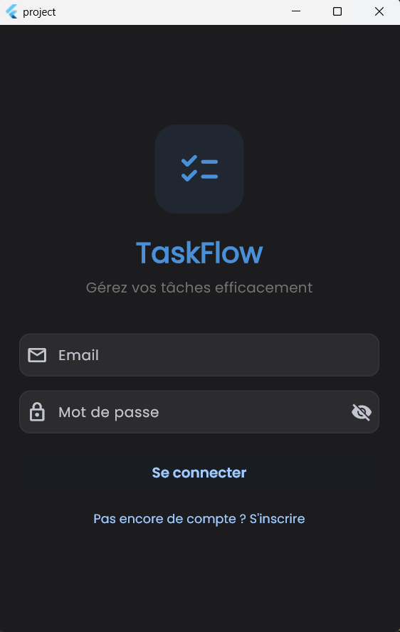
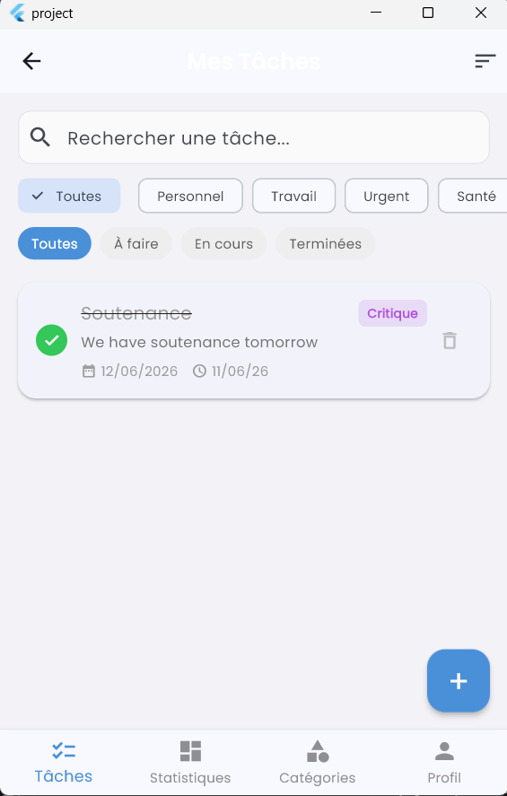
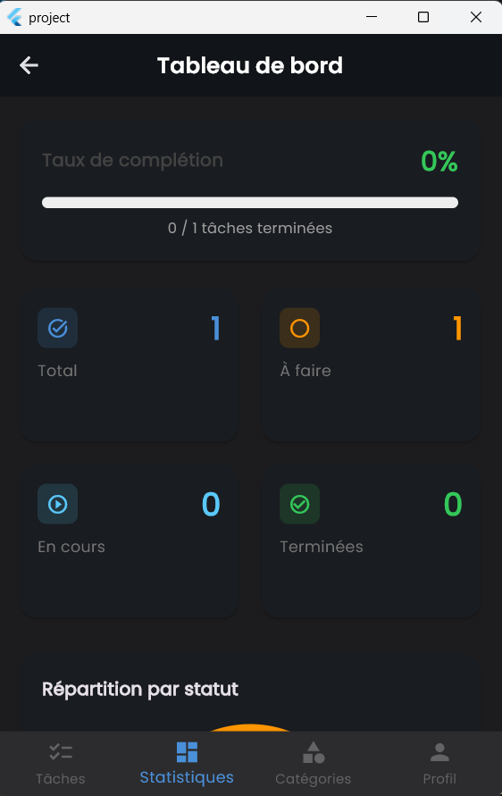

# 📋 TaskFlow — Application de Gestion des Tâches

> **Projet Flutter** — Architecture MVC  
> Application mobile de gestion de tâches inspirée de Trello / Todoist

---

## 📱 Aperçu

| Connexion | Liste des tâches | Dashboard | Dark Mode |
|:---:|:---:|:---:|:---:|
|  |  |  |  |


---

## ✨ Fonctionnalités

### Authentification
- Inscription / Connexion avec validation des champs
- Session persistante via `SharedPreferences`
- Déconnexion sécurisée

### Gestion des Tâches (CRUD)
| Action | Description |
|--------|-------------|
| **Créer** | Nouvelle tâche avec titre, description, priorité, catégorie, échéance |
| **Lire** | Liste filtrée par statut/catégorie, recherche textuelle |
| **Modifier** | Édition de tous les champs |
| **Supprimer** | Confirmation avant suppression |

### Filtres & Tri
- Par statut (À faire / En cours / Terminées)
- Par catégorie
- Recherche textuelle
- Tri : date, priorité, titre, échéance

### Catégories
- Création / Modification / Suppression
- 10 couleurs et 10 icônes disponibles
- Catégories par défaut : Personnel, Travail, Urgent, Santé, Courses, Loisirs

### Tableau de bord
- Taux de complétion avec barre de progression
- Statistiques (Total, À faire, En cours, Terminées)
- Graphique circulaire (répartition par statut)
- Graphique à barres (répartition par priorité)
- Barres par catégorie

### Interface
- **Material 3** Design
- **Dark Mode** (bascule dans le profil)
- **Thème personnalisé** avec la police Poppins
- Animations et transitions fluides
- Design responsive

---

## 🏗 Architecture MVC

```
lib/
├── main.dart                  # Point d'entrée, providers, routes
│
├── config/
│   ├── theme.dart             # Thèmes clair/sombre, couleurs priorités
│   └── routes.dart            # Routes nommées
│
├── models/          (MODEL)
│   ├── task.dart              # Modèle Task + fromMap/toMap/fromJson/toJson
│   ├── category.dart          # Modèle Category
│   └── user.dart              # Modèle User
│
├── controllers/    (CONTROLLER)
│   ├── auth_controller.dart   # Auth (login/register/logout), validation
│   ├── task_controller.dart   # CRUD tâches, filtres, tri, synchro API
│   ├── category_controller.dart # CRUD catégories
│   └── dashboard_controller.dart # Statistiques agrégées
│
├── views/          (VIEW)
│   ├── auth/
│   │   ├── login_page.dart
│   │   └── register_page.dart
│   ├── tasks/
│   │   ├── task_list_page.dart
│   │   ├── task_detail_page.dart
│   │   └── task_form_page.dart
│   ├── categories/
│   │   └── category_page.dart
│   ├── dashboard/
│   │   └── dashboard_page.dart
│   └── profile/
│       └── profile_page.dart
│
├── services/
│   ├── database_service.dart  # SQLite (sqflite + sqflite_common_ffi)
│   ├── api_service.dart       # REST API (with mock fallback)
│   └── auth_service.dart      # SharedPreferences session
│
└── widgets/         (WIDGETS)
    ├── task_card.dart         # Carte de tâche réutilisable
    ├── priority_badge.dart    # Badge de priorité coloré
    └── stat_card.dart         # Carte de statistique
```

### Principe MVC appliqué

- **Model** : Classes de données pures (`Task`, `Category`, `User`) avec sérialisation JSON/SQLite
- **View** : Widgets Flutter qui écoutent les contrôleurs via `Consumer<T>` (Provider)
- **Controller** : `ChangeNotifier` contenant la logique métier, validation, appels services

Les vues n'accèdent jamais directement aux services. Elles passent uniquement par les contrôleurs.

---

## 🛠 Technologies

| Technologie | Usage |
|-------------|-------|
| **Flutter** | Framework mobile multiplateforme |
| **Dart** | Langage |
| **Provider** | State management (InheritedWidget) |
| **sqflite** / **sqflite_common_ffi** | Base de données SQLite locale |
| **http** | Appels API REST |
| **SharedPreferences** | Stockage session utilisateur |
| **fl_chart** | Graphiques (pie, bar, progress) |
| **intl** | Formatage dates |
| **google_fonts** | Police Poppins |
| **Material 3** | Design system |

---

## 📦 Installation

### Prérequis
- Flutter SDK `^3.11.5` (ou version compatible)
- Windows : Developer Mode activé (pour les symlinks)

### Étapes

```bash
# 1. Cloner le dépôt
git clone https://github.com/votre-compte/taskflow.git
cd taskflow

# 2. Installer les dépendances
flutter pub get

# 3. Lancer l'application
flutter run
```

Pour Windows, si vous rencontrez une erreur de symlinks :
```bash
# Activer le Mode Développeur Windows
start ms-settings:developers
```

---

Les fichiers `.png` seront créés dans le dossier `screenshots/`.

---

## 🧪 Fonctionnalités avancées

- **API REST** : Service API avec mode mock intégré (utilise JSONPlaceholder en fallback)
- **SQLite** : 3 tables (users, categories, tasks) avec relations et contraintes
- **Dashboard** : 3 types de graphiques (pie, bar, progress bars)
- **Dark Mode** : Thème clair/sombre avec toggle utilisateur
- **Filtres** : Statut, catégorie, recherche, tri

---
